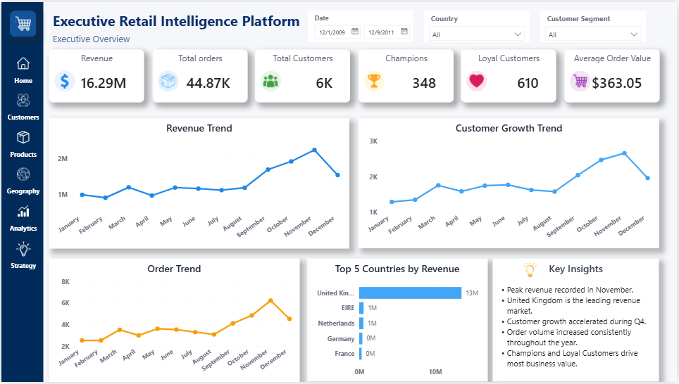
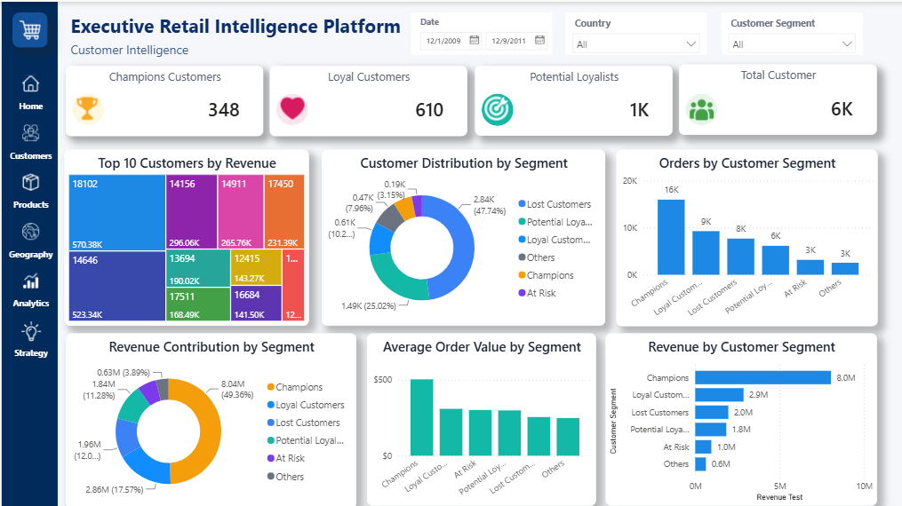
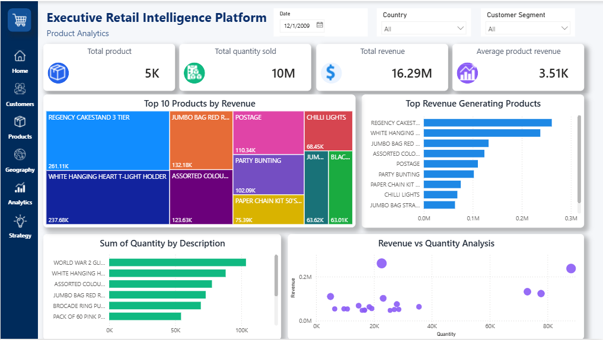
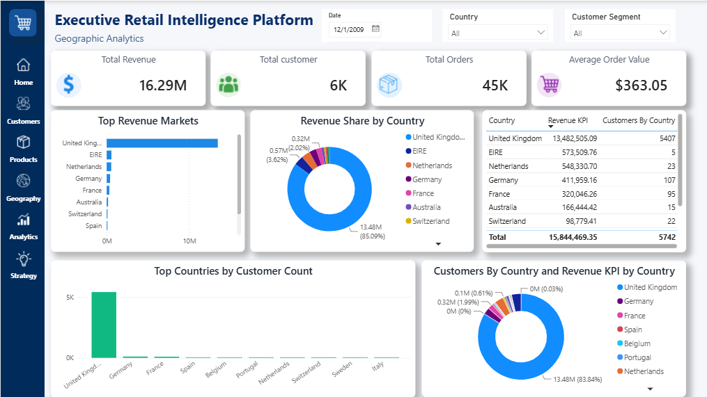
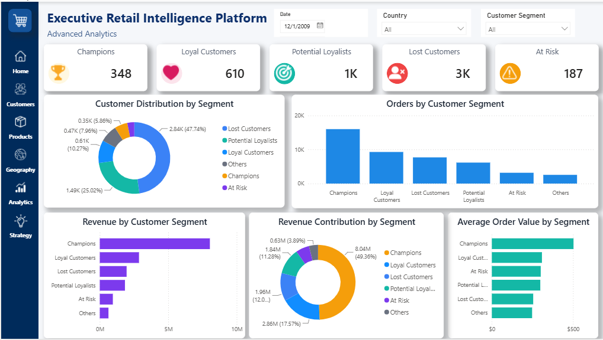
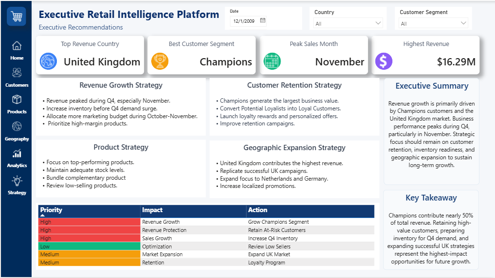

# Executive Retail Intelligence Platform

## Project Overview

The Executive Retail Intelligence Platform is an executive-level Business Intelligence dashboard developed in **Microsoft Power BI** to transform retail transaction data into strategic business insights. The dashboard enables decision-makers to monitor business performance, understand customer behavior, evaluate product performance, analyze geographic trends, and identify growth opportunities through an intuitive six-page interactive reporting solution.

This project demonstrates advanced Business Intelligence concepts including data modeling, DAX calculations, customer segmentation using RFM Analysis, forecasting, and executive storytelling.

---

## Technologies Used

- Microsoft Power BI
- Power Query
- DAX (Data Analysis Expressions)
- SQL
- Microsoft Excel

---

## Dashboard Pages

### 1. Executive Overview

Provides a comprehensive overview of business performance through executive KPIs and trend analysis.

**Key KPIs**
- Revenue
- Total Orders
- Total Customers
- Champion Customers
- Loyal Customers
- Average Order Value

**Visualizations**
- Revenue Trend
- Customer Growth Trend
- Order Trend
- Top Revenue Countries
- Executive Insights

---

### 2. Customer Intelligence

Analyzes customer behavior using RFM Segmentation to identify high-value customers and retention opportunities.

**Key KPIs**
- Champion Customers
- Loyal Customers
- Potential Loyalists
- Total Customers

**Visualizations**
- Customer Distribution by Segment
- Revenue Contribution by Segment
- Orders by Customer Segment
- Average Order Value by Segment
- Top Customers by Revenue

---

### 3. Product Analytics

Evaluates product performance, sales contribution, and product profitability.

**Key KPIs**
- Total Products
- Total Quantity Sold
- Total Revenue
- Average Product Revenue

**Visualizations**
- Top Products by Revenue
- Revenue Generating Products
- Product Revenue Treemap
- Quantity Sold by Product
- Revenue vs Quantity Analysis

---

### 4. Geographic Analytics

Provides geographical insights into revenue and customer distribution.

**Key KPIs**
- Total Revenue
- Total Customers
- Total Orders
- Average Order Value

**Visualizations**
- Revenue Share by Country
- Top Revenue Markets
- Customer Distribution by Country
- Revenue KPI by Country
- Top Countries by Customer Count

---

### 5. Advanced Analytics

Presents advanced customer intelligence through RFM segmentation.

**Key KPIs**
- Champions
- Loyal Customers
- Potential Loyalists
- Lost Customers
- At-Risk Customers

**Visualizations**
- Customer Segment Distribution
- Revenue by Customer Segment
- Revenue Contribution Analysis
- Average Order Value by Segment
- Orders by Customer Segment

---

### 6. Strategic Recommendations

Converts analytical findings into executive business recommendations.

**Key KPIs**
- Top Revenue Country
- Best Customer Segment
- Peak Sales Month
- Highest Revenue

**Strategic Areas**
- Revenue Growth Strategy
- Customer Retention Strategy
- Product Strategy
- Geographic Expansion Strategy
- Executive Summary
- Business Priority Matrix
- Key Takeaways

---

## Key Business Insights

- United Kingdom generated the highest overall revenue.
- Champion customers contributed nearly half of the total business revenue.
- Sales performance peaked during Quarter 4, especially in November.
- Loyal customers generated consistent long-term revenue.
- Several products accounted for the majority of total revenue, supporting Pareto analysis.
- Geographic analysis identified expansion opportunities beyond the primary market.
- Strategic recommendations focused on customer retention, inventory planning, and market expansion.

---

## Business Questions Answered

- Which country generates the highest revenue?
- Which customer segment contributes the most revenue?
- Which products drive the majority of sales?
- Which month records peak sales performance?
- How are customers distributed across RFM segments?
- Which markets present future growth opportunities?
- What strategic initiatives should management prioritize?

---

## Skills Demonstrated

- Business Intelligence
- Power BI Dashboard Development
- Data Cleaning
- Power Query
- Data Modeling
- DAX Calculations
- RFM Customer Segmentation
- Executive KPI Design
- Product Analytics
- Geographic Analytics
- Strategic Business Reporting
- Interactive Dashboard Design
- Executive Storytelling

---

## Dashboard Preview

### Executive Overview

---

### Customer Intelligence

---

### Product Analytics

---

### Geographic Analytics

---

### Advanced Analytics

---

### Strategic Recommendations

---

## Dataset

**Online Retail II Dataset**

Source:
https://archive.ics.uci.edu/ml/datasets/online+retail+ii

---

## Project Highlights

- Developed a professional six-page executive dashboard.
- Designed executive KPI cards with interactive slicers.
- Implemented RFM customer segmentation.
- Created advanced DAX measures for business metrics.
- Built product, customer, and geographic performance dashboards.
- Delivered executive recommendations backed by data-driven insights.
- Applied modern dashboard design principles for executive reporting.

---

## Author

**Aleeza Iftikhar**

**GitHub:** https://github.com/Aleeza4

**LinkedIn:** *https://www.linkedin.com/in/aleeza-iftikhar-61a56127b/*

---

If you found this project useful or insightful, please consider starring the repository.
